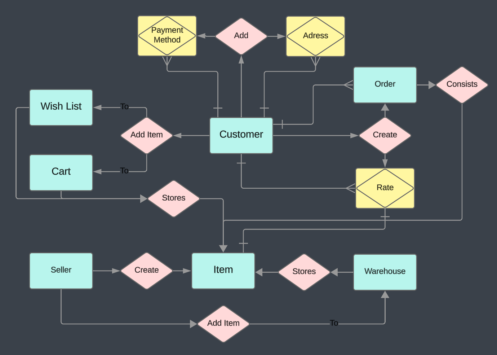

# Database Design Documentation

## Table of Contents
1. [Database Structure Summary](#Database-Structure-Summary)
2. [Database Creation Description](#Database-Creation-Description)
3. [Database Schema](#Database-Schema)
4. [Entity Relationship Diagram](#Entity-Relationship-Diagram)
5. [Database Normalization](#Database-Normalization)


# Database Structure Summary
The database consists of several tables, each representing a different entity. 

1. ### [Customers](#Customers): Stores information about the customers.

2. ### [Addresses](#Addresses): Stores the addresses of the customers.

3. ### [Payment Methods](#Payment-Methods): Stores the payment methods of the customers.

4. ### [Sellers](#Sellers): Stores information about the sellers.

5. ### [Orders](#Orders): Stores information about the orders.

6. ### [Items](#Items): Stores information about the items.

7. ### [Customer Item Cart](#Customer-Item-Cart): Stores information about the items in the customer's cart.

8. ### [Customer Item Wish](#Customer-Item-Wish): Stores information about the items in the customer's wish list.

9. ### [Rates](#Rates): Stores the ratings and comments given by customers to items.

10. ### [Order Item](#Order-Item): Stores information about the connection between items and order.

11. ### [Warehouses](#Warehouses): Stores information about the warehouses.

12. ### [Warehouse Items](#Warehouse-Items): Stores information about the items in a warehouse.

Each table has a primary key, which uniquely identifies each record in the table. There are also several foreign key relationships between the tables, which establish links between related data across tables. For example, the `customer_id` in the `Addresses` table is a foreign key that references the `id` in the `Customers` table. This means that each address is associated with a specific customer.

This database is designed to support a variety of operations for an e-commerce platform, including customer management, order processing, item management, and warehouse management.

# Database Creation Description

- ## Customers
  [Back to summary](#Database-Structure-Summary)
    ```postgresql
    CREATE TABLE "customers" (
        "id" integer PRIMARY KEY,
        "name" varchar,
        "surname" varchar,
        "login" varchar,
        "password" varchar,
        "age" int,
        "verified" boolean,
        "created_at" timestamp,
        "cart_price" float
    );
    ```
    ### We Started from creating table `customers` it contains information about customers. Then we decided that we want to store delivery addresses and payment methods of customers. As one customer can have more than one addresses and payment method we created two more tables `addresses` and `payment_methods` which are connected to `customers` table by foreign keys.

- ## Addresses
  [Back to summary](#Database-Structure-Summary)
    ```postgresql
    CREATE TABLE "addresses" (
        "id" integer PRIMARY KEY,
        "customer_id" integer,
        "address" varchar
    );
    ```
    ### Table `addresses` contains information about delivery address of customers. It is connected to `customers` table by foreign key `customer_id`.

- ## Payment Methods
  [Back to summary](#Database-Structure-Summary)
    ```postgresql
    CREATE TABLE "payment_methods" (
        "customer_id" integer,
        "card_number" varchar,
        "cvc" int,
        "card_holder" varchar,
        "valid_until" varchar,
        PRIMARY KEY ("customer_id", "card_number")
    );
    ```
    ### Table `payment_methods` contains information about payment methods of customers. It is connected to `customers` table by foreign key `customer_id` & `card_number`.

- ## Sellers
  [Back to summary](#Database-Structure-Summary)
    ```postgresql
    CREATE TABLE "sellers" (
        "id" integer PRIMARY KEY,
        "title" varchar,
        "login" varchar,
        "password" varchar,
        "rate" float,
        "created_at" timestamp,
        "address" varchar,
        "card_number" varchar,
        "total_sales" float
    );
    ```
    ### Then we implemented Table `sellers` that contains information about sellers. It is connected to `items` table by foreign key `id`. We decided to separate sellers from customers because they have very different roles in the system and set of properties.

- ## Items
    [Back to summary](#Database-Structure-Summary)
    ```postgresql
    CREATE TABLE "items" (
        "id" integer PRIMARY KEY,
        "title" varchar,
        "category" enum,
        "rate" float,
        "description" text,
        "seller_id" integer,
        "cost" float,
        "created_at" timestamp
    );
    ```
    ### Table `items` contains information about items that are present in the store. It is connected to `sellers` table by foreign key `seller_id`.

- ## Customer Item Cart
    [Back to summary](#Database-Structure-Summary)
    ```postgresql
    CREATE TABLE "customer_item_cart" (
        "customer_id" integer,
        "item_id" integer,
        "amount" int,
        PRIMARY KEY ("customer_id", "item_id")
    );
    ```
    ### Table `customer_item_cart` contains information about items that are present in the cart of customers. It is connected to `customers` and `items` tables by foreign keys `customer_id` and `item_id`. By adding item to cart we connect customer with item. Primary key constraint is added to `customer_id` and `item_id` to avoid duplication of product in one cart. 
  
- ## Customer Item Wish
  [Back to summary](#Database-Structure-Summary)
    ```postgresql
    CREATE TABLE "customer_item_wish" (
        "customer_id" integer,
        "item_id" integer,
        PRIMARY KEY ("customer_id", "item_id")
    );
    ```
  ### Table `customer_item_wish` contains information about items that are present in the wish list of customers. It works the same way as `customer_item_cart` table.

- ## Rates
  [Back to summary](#Database-Structure-Summary)
    ```postgresql
    CREATE TABLE "rates" (
        "customer_id" integer,
        "item_id" integer,
        "rate" float,
        "body" text,
        PRIMARY KEY ("customer_id", "item_id")
    );
    ```
    ### Table `rates` contains information about rates given by customers to items. It is connected to `customers` and `items` tables by foreign keys `customer_id` and `item_id`.

- ## Orders
  [Back to summary](#Database-Structure-Summary)
    ```postgresql
    CREATE TABLE "orders" (
        "id" integer PRIMARY KEY,
        "customer_id" integer,
        "delivery_address" varchar,
        "status" enum,
        "total_cost" float,
        "created_at" timestamp,
        "comment" text
    );
    ```
    ### Table `oders` contains information about orders. It is connected to `customers` table by foreign key `customer_id`.

- ## Order Item
  [Back to summary](#Database-Structure-Summary)
    ```postgresql
    CREATE TABLE "order_item" (
        "order_id" integer,
        "item_id" integer,
        "amount" int,
        PRIMARY KEY ("order_id", "item_id")
    );
    ```
  ### Table `order_item` contains information about items that are present in the order. It is connected to `Orders` and `Items` tables by foreign keys `order_id` and `item_id`. We made it a separate table because one order can contain multiple items.

- ## Warehouses
  [Back to summary](#Database-Structure-Summary)
    ```postgresql
    CREATE TABLE "warehouses" (
        "id" integer PRIMARY KEY,
        "title" varchar,
        "address" varchar
    );
    ```
    ### Table `warehouses` contains information about warehouses. This table was made in purpose to store different items in different warehouses.

- ## Warehouse Items
  [Back to summary](#Database-Structure-Summary)
    ```postgresql
    CREATE TABLE "warehouse_items" (
        "warehouse_id" integer,
        "item_id" integer,
        "amount" int,
        PRIMARY KEY ("warehouse_id", "item_id")
    );
    ```
    ### Table `warehouse_items` contains information about items that are present in the warehouse. It is connected to `warehouses` and `items` tables by foreign keys `warehouse_id` and `item_id`. We made it a separate table because one warehouse can contain multiple items.

# Database Schema


# Entity Relationship Diagram


# Database Normalization

